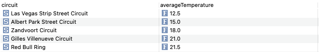
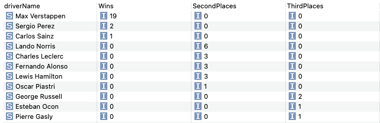
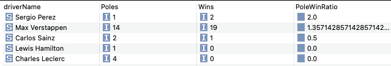

# Formula 1 RDFS/OWL Ontology

## Overview

### RDFS
This repository contains an RDF Schema (RDFS) for representing Formula 1 data in a structured format. The ontology is designed to capture various aspects of Formula 1, including teams, drivers, races, circuits, and more, allowing for standardized data representation and interoperability.

### OWL
This repository contains an OWL ontology for representing Formula 1 data in a structured format. Based on the RDF Schema with added restrictions and features to enhance data integrity and expressivity.

## Contents

### RDFS
- `RDFS/formula1.ttl`: The RDF Schema file defining the Formula 1 ontology.
- `RDFS/Queries/`: Directory containing example SPARQL queries for querying the Formula 1 data.

### OWL
- `OWL/formula1.ttl`: The OWL file defining the Formula 1 ontology.
- 
## Queries
The ontology has a certain level of complexity to capture and produce various useful SPARQL Queries.  
Some examples can be shown below:

### Query 1: Find all coldest circuits based on the average temperature of FPs, Qualis and Race in each circuit.

### Query 2: Find the total number of First, Second and Third Places achieved by every driver in season 2023.

### Query 3: Calculate the Pole/Win Ratio of every driver with at least a Pole or Win.

## Usage

The ontology is in Turtle Format. Use a proper application like Protege or Topbraid Composer.
